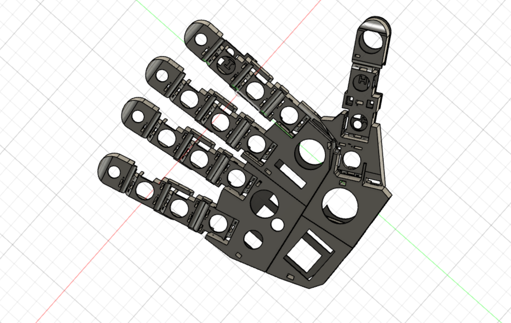
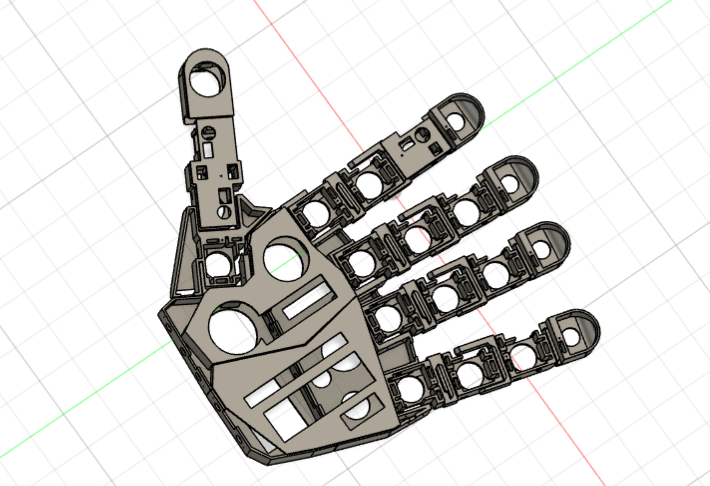
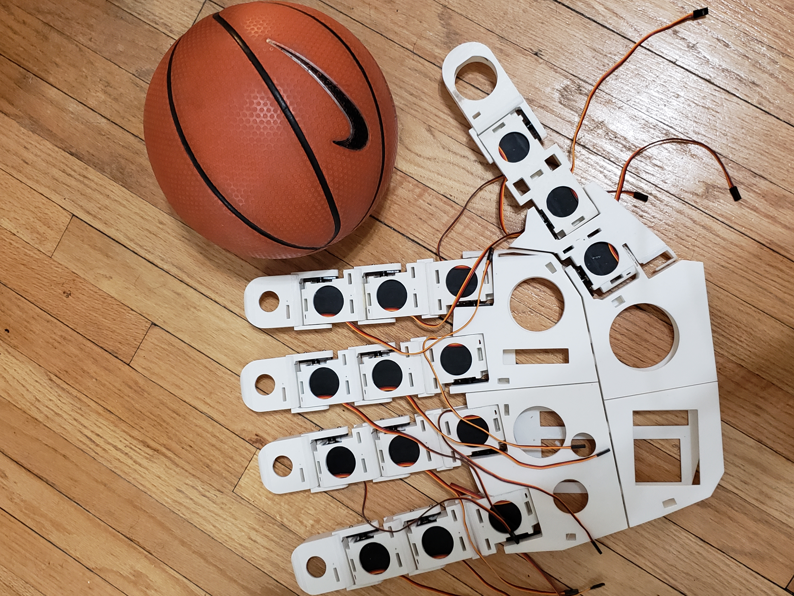

# Robotic-Hand
A 3D-printed robotic hand that is controlled using an Arduino microcontroller

<html>
  
YouTube link: https://youtu.be/VooYuoH0FPQ
  
  
Here are pictures of the 3D design: 
 
   
    
  
Here is the final design with a basketball for scale:
 
  
    
  <b>servo.ino</b> is a potion of the program that goes in the Arduino microcontroller. There are still more steps before the completion of this project. Here is a YouTube link to how the hand is working so far: https://youtu.be/VooYuoH0FPQ
</html>
